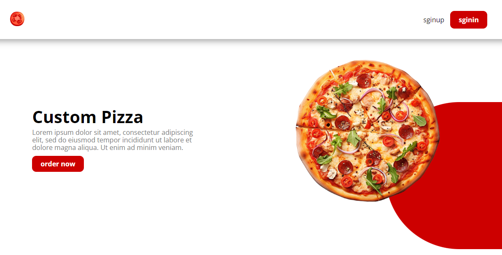
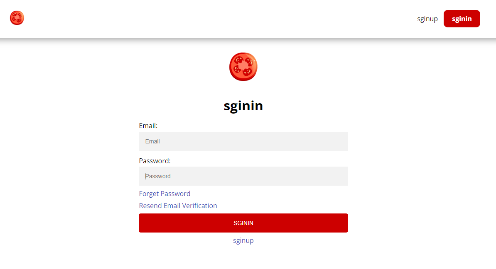
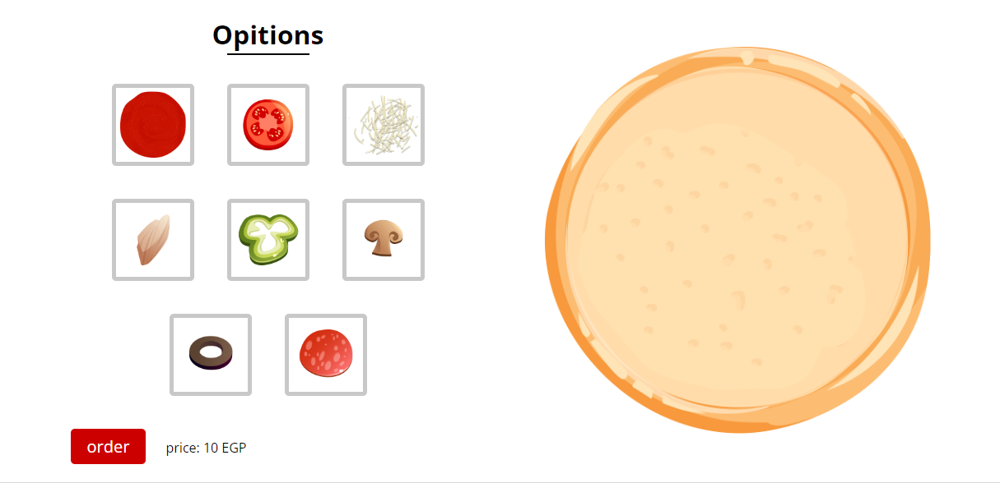
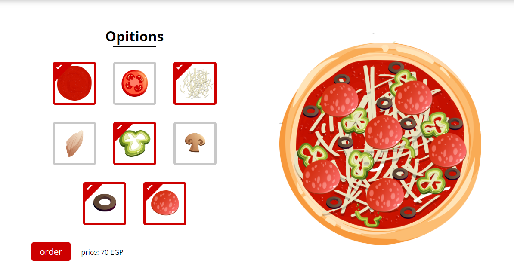
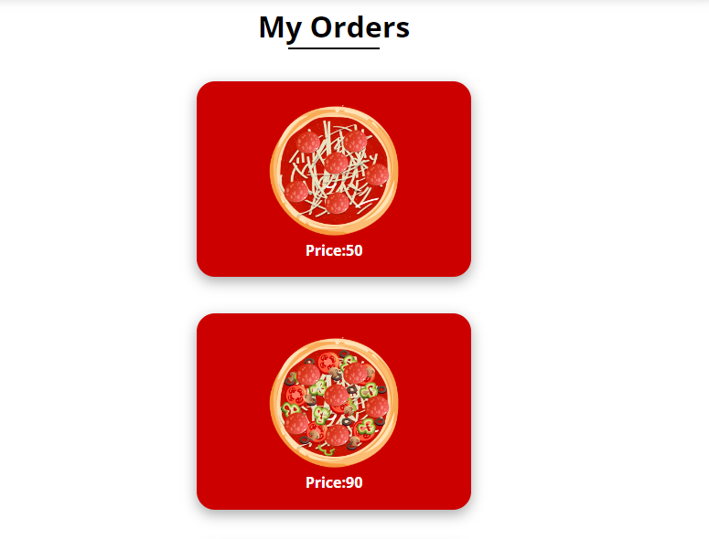
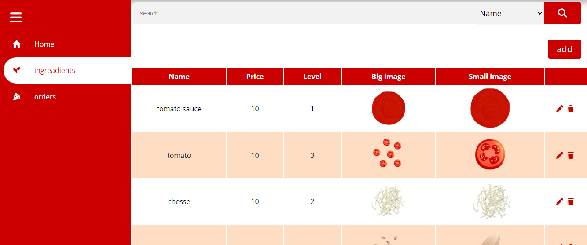

# CustomPizza

CustomPizza is an interactive online platform that allows users to create and order personalized pizzas. The platform provides a seamless experience for selecting toppings, sauces, crust types, and sizes, ensuring customer satisfaction.

---

## 🌟 Features
- **Custom Pizza Creation**: Users can build their pizzas with a variety of options for toppings, sauces, and crusts.
- **Interactive User Experience**: Real-time updates to the price and preview of the selected pizza.
- **Order Management**: Allows users to place, track, and manage orders.
- **Responsive Design**: Optimized for desktop and mobile devices.

---

## 🛠️ Technologies Used
- **Frontend**: HTML, CSS, JavaScript, React.js
- **Backend**: Node.js, Express.js
- **Database**: MongoDB

---

## 🚀 Installation and Setup

### Prerequisites
- Node.js and npm installed
- MongoDB installed or access to a MongoDB Atlas cluster

### Steps
1. Clone the repository:
   ```bash
   git clone https://github.com/mmud/pizzacustom.git
   ```

2. Set up the **Frontend**:
   - Navigate to the frontend folder:
     ```bash
     cd pizzacustom/frontend
     ```
   - Install dependencies:
     ```bash
     npm install
     ```
   - Start the frontend server:
     ```bash
     npm start
     ```

3. Set up the **Backend**:
   - Open a new terminal and navigate to the backend folder:
     ```bash
     cd pizzacustom/backend
     ```
   - Install dependencies:
     ```bash
     npm install
     ```
   - Set up environment variables:
     - Create a `.env` file in the backend directory.
     - Add the following variables:
       ```
       MONGO_URI=your_mongodb_connection_string
       JWT_SECRET=your_jwt_secret
       ```
   - Start the backend server:
     ```bash
     npm start
     ```

4. Access the platform in your browser at `http://localhost:3000`.

---

## 🖥️ Screenshots

### Home Page


### Login Page


### Create the Pizza



### Order


### Dashboard

---

## 📈 Achievements
- Enhanced customer engagement with a user-friendly pizza customization interface.
- Improved order processing efficiency through seamless backend integration.

---

## 📄 License
This project is licensed under the MIT License. See the [LICENSE](LICENSE) file for details.