# CustomPizza

CustomPizza is an interactive online platform that allows users to create and order personalized pizzas. The platform provides a seamless experience for selecting toppings, sauces, crust types, and sizes, ensuring customer satisfaction.

---

## 🌟 Features
- **Custom Pizza Creation**: Users can build their pizzas with a variety of options for toppings, sauces, and crusts.
- **Interactive User Experience**: Real-time updates to the price and preview of the selected pizza.
- **Order Management**: Allows users to place, track, and manage orders.
- **Shopping Cart**: A detailed shopping cart for reviewing and managing orders before checkout.
- **Payment Gateway Integration**: Secure payment processing using Stripe.
- **AI-Powered Recommendations**: Personalized pizza recommendations using an AI model.
- **Dashboard for Orders**: A comprehensive dashboard for users to view and manage their orders.
- **Responsive Design**: Optimized for desktop and mobile devices.

---

## 🛠️ Technologies Used
- **Frontend**: HTML, CSS, JavaScript, React.js
- **Backend**: Node.js, Express.js
- **Database**: MongoDB
- **AI Model**: Python, Flask, Scikit-learn
- **Payment Integration**: Stripe API

---

## 🚀 Installation and Setup

### Prerequisites
- Node.js and npm installed
- MongoDB installed or access to a MongoDB Atlas cluster

### Steps
1. Clone the repository:
   ```bash
   git clone https://github.com/mmud/pizzacustom.git
   ```

2. Set up the **Frontend**:
   - Navigate to the frontend folder:
     ```bash
     cd pizzacustom/frontend
     ```
   - Install dependencies:
     ```bash
     npm install
     ```
   - Start the frontend server:
     ```bash
     npm start
     ```

3. Set up the **Backend**:
   - Open a new terminal and navigate to the backend folder:
     ```bash
     cd pizzacustom/backend
     ```
   - Install dependencies:
     ```bash
     npm install
     ```
   - Set up environment variables:
     - Create a `.env` file in the backend directory.
     - Add the following variables:
       ```
        NODE_ENV = development
        PORT = 3500
        MONGO_URL = mongodb://localhost:27017/pizza
        JWT_SECRET = secretpassword

        FRONTURL = "http://localhost:3000"
        AI_URL ="http://localhost:5000"
        HOST= smtp.gmail.com
        SERVICE= gmail
        EMAIL_PORT= 587
        SECURE= true
        EMAIL_FROM= 
        EMAIL_PASSWORD = 
        STRIPE_SECRET_KEY=stripesecretkey
       ```
   - Start the backend server:
     ```bash
     npm start
     ```

4. Set up the **AI Recommendation Server**:
   - Open another terminal and navigate to the AI model folder:
     ```bash
     cd pizzacustom/"recommendation ai model"
     ```
   - Install required Python libraries:
     ```bash
     pip install -r requirements.txt
     ```
   - Run the AI server:
     ```bash
     python model_api.py
     ```

5. Access the platform:
- Open your browser and go to `http://localhost:3000`.

---

## 🖥️ Screenshots

### Home Page
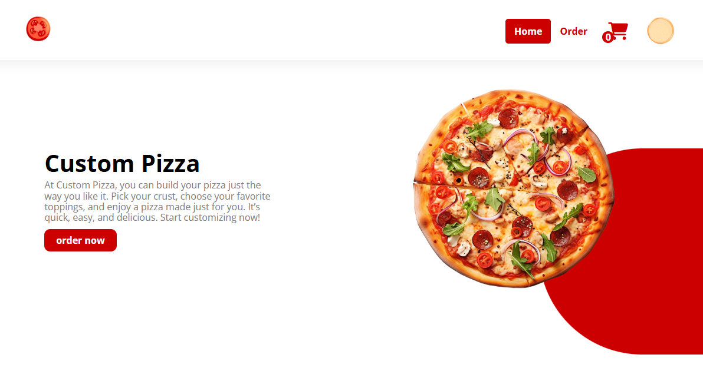

### Recommendations
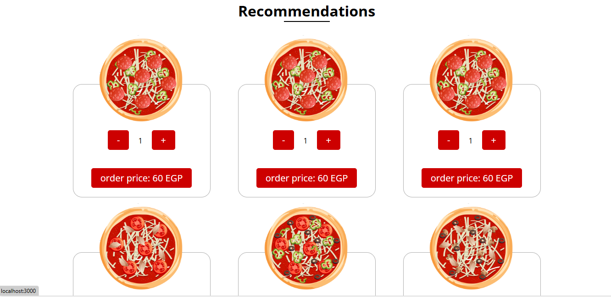

### Login Page
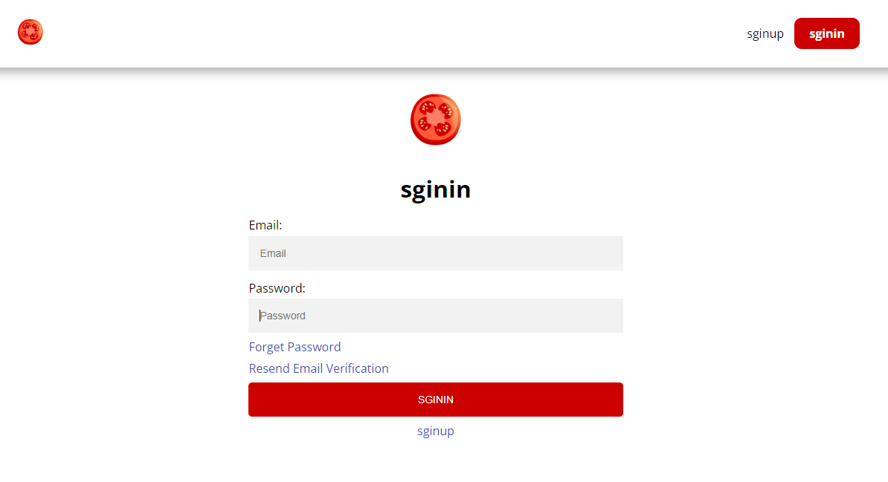

### Create the Pizza
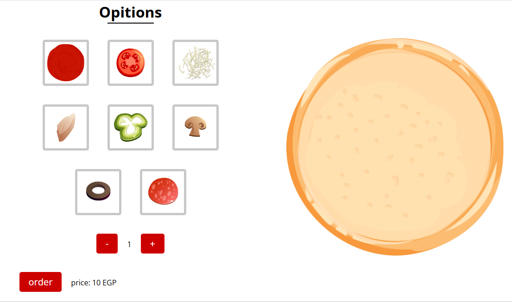
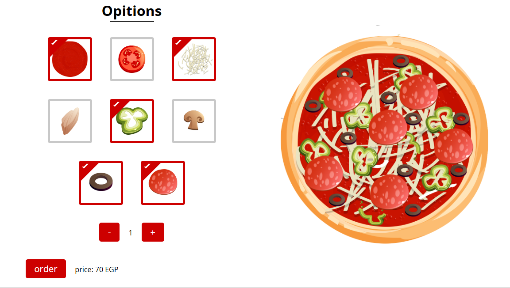

### Shopping Cart
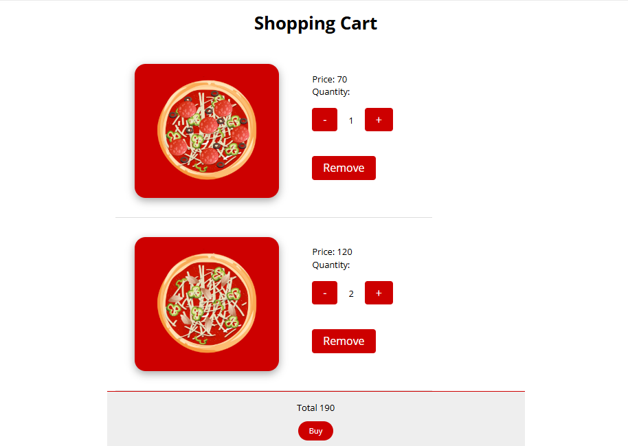
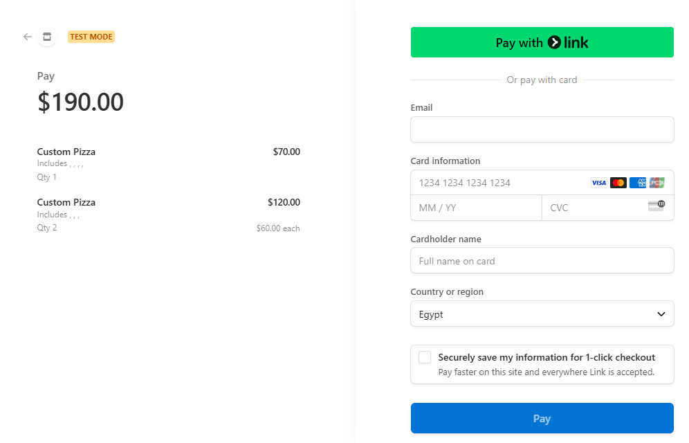
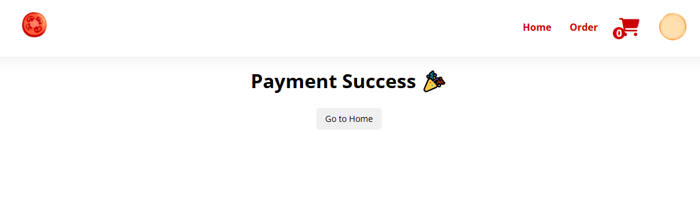
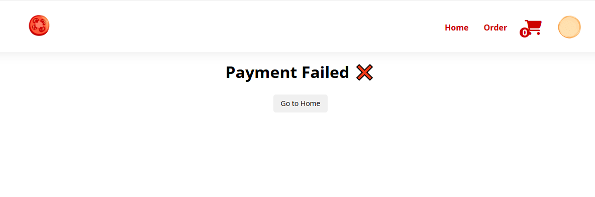
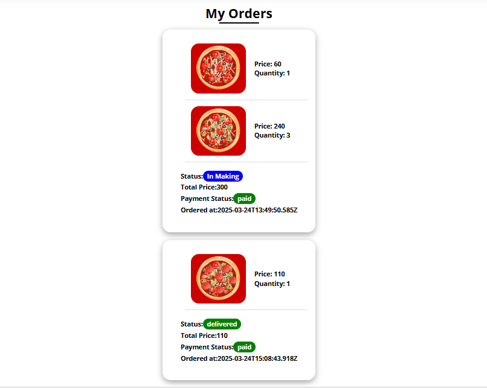

### Dashboard
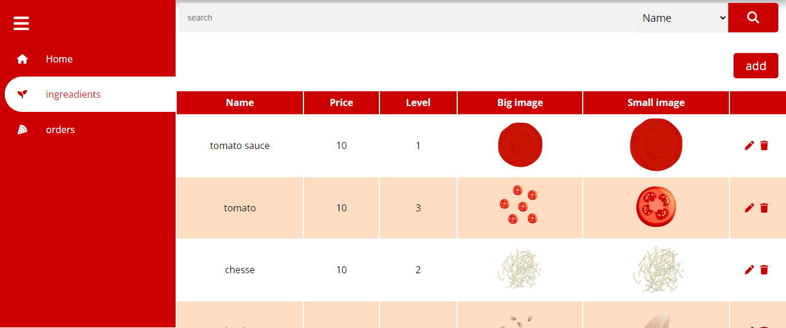
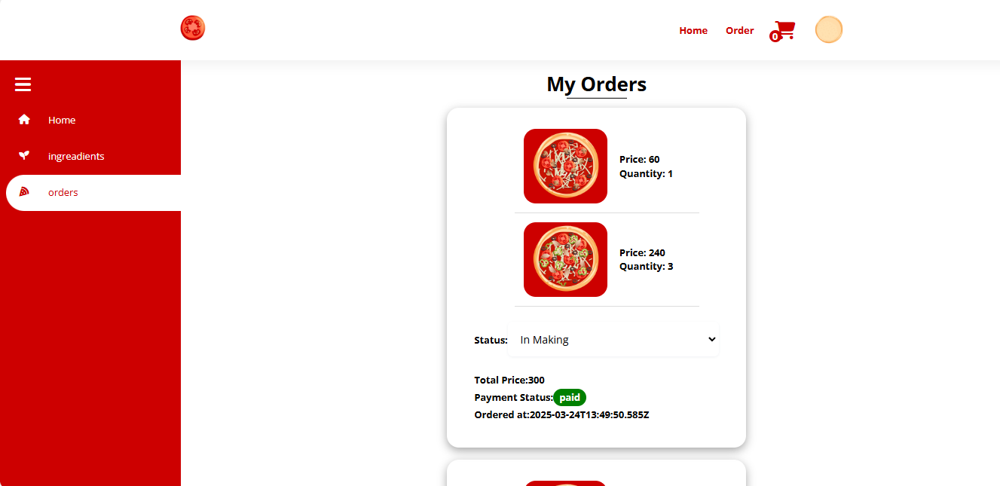
---

## 📈 Achievements
- Enhanced customer engagement with a user-friendly pizza customization interface.
- Improved order processing efficiency through seamless backend integration.
- Implemented a secure payment gateway using Stripe for hassle-free transactions.
- Developed an AI-powered recommendation system for personalized user experiences.
- Provided users with an intuitive dashboard for managing their orders.

---

## 📄 License
This project is licensed under the MIT License. See the [LICENSE](LICENSE) file for details.